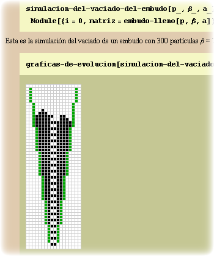
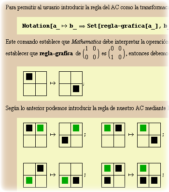
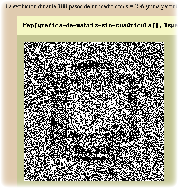

.. -*- mode: rst; mode: flyspell; mode: auto-fill; mode: wiki-nav-*- 

========================================================================
Simulación de autómatas celulares con vecindad de Margolus (2000 - 2002)
========================================================================

.. raw:: html

   <table border="0" id="front-page" align="center">
   <td width="80%">

La parte más interesante y extensa de mi tesis de pregrado fue la creación de
un notebook en el que explicaba paso a paso cómo simular el flujo de arena por
un embudo, por medio de un autómata celular con vecindad de Margolus.

Haciendo uso de las increíbles capacidades de manipulación simbólica que ofrece
*Mathematica*, durante mi trabajo también ideé una forma en la que se podían definir
gráficamente las reglas de evolución del autómata y creé una paleta para
poder introducirlas fácilmente a cualquier otro notebook.

Mi intención era que los futuros usuarios del notebook pudieran definir sus
propias reglas, sin tener que preocuparse por como programarlas, y que sólo
tuvieran que crear una rutina de visualización para observar los resultados de
sus autómatas. Como ejemplo, yo mismo definí las reglas del `gas HPP`_ y mostré
como éste puede reproducir cualitativamente el comportamiento de una onda de
presión en un gas de partículas.

Los interesados pueden :download:`descargar <../downloads/Automatas celulares
con vecindad de Margolus.zip>` el notebook y la paleta que lo acompaña
(actualizados para Mathematica 8), y pueden encontrar más reglas de evolución
para otros fenómenos físicos en la `tesis`_ de Norm Margolus.

.. _gas HPP: http://en.wikipedia.org/wiki/Lattice_gas_automaton

.. _tesis: http://people.csail.mit.edu/nhm/thesis.pdf

.. raw:: html
   </td>
   
   <td width="30%">
   
   </td>
   </table>

..  LocalWords:  LocalWords pregrado Margolus table tr td notebook Mathematica
..  LocalWords:  HPP html width Norm download downloads zip pdf center http
..  LocalWords:  hpp
