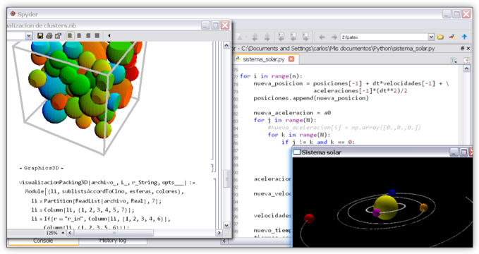

.. -*- mode: rst; mode: flyspell; mode: auto-fill; mode: wiki-nav-*- 

=========
Proyectos
========= 

La mayoría de mi trabajo ha estado
orientado hacia la programación y el desarrollo de software, porque
creo firmemente en que el futuro de la ciencia reside en la creación de
nuevos y cada vez más potentes modelos computacionales.

A lo largo de mi carrera profesional he trabajado principalmente en lenguajes
de alto
nivel, como :doc:`Python <Python>` y :doc:`Mathematica <Mathematica>`, pues considero
que están mejor capacitados para realizar el tipo de programación
*exploratoria* a la que se enfrentan los científicos en su trabajo,
y que involucra: bosquejar rápidamente un modelo, procesar y graficar datos
experimentales, compararlos con el modelo y repetir el ciclo.

De los lenguajes que comúnmente se usan en computación científica
(e.g. Fortran o C), sólo he utilizado :doc:`C++`, porque la velocidad de
cómputo era de suma importancia.

..  LocalWords:  LocalWords toctree maxdepth Mathematica Jürgen Tischer Python
..  LocalWords:  pregrado notebooks ref doc width html td projects static src
..  LocalWords:  border front page align center png graficar img image
