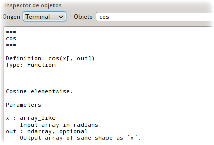
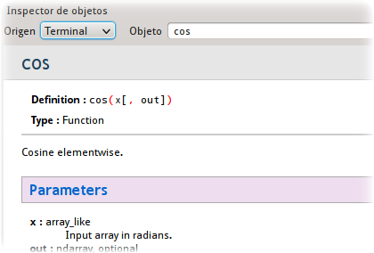
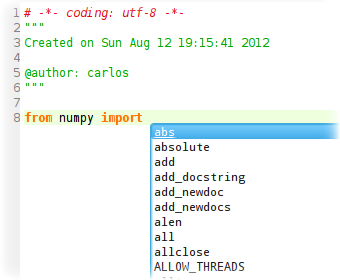
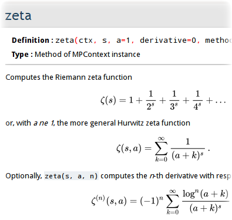
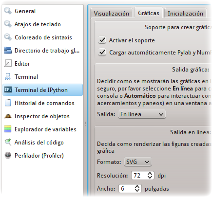
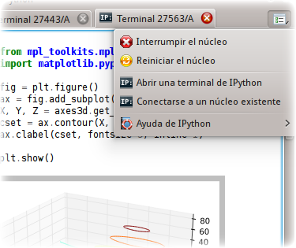
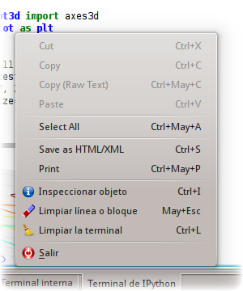
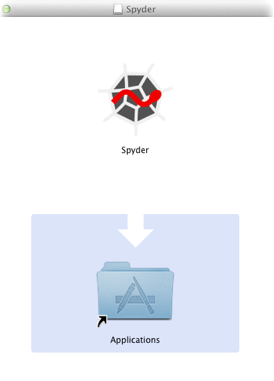

.. -*- mode: rst; mode: flyspell; mode: auto-fill; mode: wiki-nav-*- 

===================
Spyder (Desde 2010)
===================

.. raw:: html

   <table border="0" id="front-page" align="center">
   <td width="74%">

A principios de 2010 el Profesor Fernando Perez de la Universidad de Berkeley,
y creador de `IPython`_, vino a la Universidad de los Andes por intercesión
mía, a dictarnos a varios estudiantes de posgrado un `seminario`_ sobre el uso
de *Python* en computación científica. Este encuentro fue crucial para mí, pues
me enseñó como utilizar y sacar el máximo provecho de las librerías científicas
basadas en este lenguaje, y de las interfaces científicas para acceder a ellas.

Lastimosamente las herramientas que nos mostró el Profesor Perez no constituían
una entorno integrado, sino un conjunto de piezas inconexas cuyo uso no
favorece demasiado la productividad del científico. Por ejemplo: el código se
editaba en un programa y se debía ejecutar en otro, la documentación (aunque
fácilmente accesible) se mostraba en texto plano, y no era posible inspeccionar
visualmente los resultados obtenidos.

Después de mi experiencia con :doc:`Mathematica <Mathematica>`, yo ya sabía qué
esperar de una plataforma científica, y no deseaba conformarme con una
situación como la descrita. En mi opinión, contar con una buena plataforma es
fundamental, pues es un programa que le permite al científico realizar un gran
número de operaciones bajo un mismo entorno, tales como: extraer datos de
distintos tipos de fuentes, procesarlos, graficarlos y ajustarlos al modelo que
uno esté desarrollando. Entre más funcionalidad tenga la plataforma y más
integrada esté, más eficiente será el desarrollo de una investigación.

Por ello me di a la tarea de buscar un programa que (al menos en parte)
cumpliese con estos requerimientos, que estuviese basado en *Python*, y que
además fuese software libre. Después de varios meses de explorar y probar
varias alternativas, finalmente me decidí por `Spyder`_ a mediados del 2010.

*Spyder* remediaba muchas de las deficiencias mencionadas, pues fue diseñado
por Pierre Raybaut como una plataforma científica capaz de reemplazar a `Matlab
<http://www.mathworks.com/products/matlab/>`_. Después de usarlo durante un par
de meses, empecé a hacer varios aportes para mejorar su funcionamiento, y en
ello he venido trabajando desde entonces.

Además de colaborar para resolver `problemas`_ (o *bugs*) en el programa y de
dar `soporte técnico`_ a los usuarios, las contribuciones más importantes que
he hecho a *Spyder* han sido:

Ayuda en texto enriquecido
--------------------------

Mi primer aporte fue hacer que *Spyder* pudiera mostrar la documentación de
funciones y clases como texto enriquecido y no como texto plano. Para ello tomé
una `pequeña librería
<http://sagenb.org/doc/static/reference/sagenb/misc/sphinxify.html>`_
desarrollada por Tim Dumol para el proyecto `Sage <http://www.sagemath.org>`_ y
la adapté para que funcionara en *Spyder*.

Antes de este aporte, el usuario sólo podía acceder a la documentación de esta
forma:

y ahora puede lo puede hacer así:

Completado de librerías
-----------------------

Unos seis meses después de esta primera contribución, le añadí a *Spyder* la
funcionalidad necesaria para que el usuario pudiera obtener sugerencias de
completado cuando está intentando cargar una librería externa. Para ello adapté
el código que con tal fin fue creado por los desarrolladores del proyecto
`IPython <http://www.ipython.org>`_, pero que en ese momento sólo funcionaba en
una terminal de comandos y no en una interfaz gráfica.

A continuación se aprecia una imagen del resultado obtenido:

Mostrar ecuaciones matemáticas en la ayuda
------------------------------------------

A principios de este año le añadí a nuestro visor de ayuda la facilidad de
renderizar ecuaciones matemáticas escritas en Latex, como se aprecia en la
siguiente imagen:

De esta forma los usuarios que están utilizando librerías creadas para realizar
matemática simbólica o de precisión arbitraria, como `SymPy
<http://sympy.org/en/index.html>`_ y `mpmath
<http://mpmath.googlecode.com/svn/trunk/doc/build/index.html>`_, pueden acceder
a sus textos de ayuda con mucha mayor facilidad.

Mejor integración con IPython
-----------------------------

Hace un año los desarrolladores de *IPython* introdujeron una novedosa interfaz
gráfica para su terminal de ejecución, en la que se pueden incluir gráficas,
ecuaciones matemáticas y código, como puede verse `aquí
<http://ipython.org/ipython-doc/dev/interactive/qtconsole.html>`_. Casi de
`inmediato
<http://spyder-ide.blogspot.com/2011/08/preview-of-new-ipython-plugin-for.html>`_,
Pierre incorporó esta terminal mejorada en *Spyder*.

Sin embargo, Pierre realizó su labor muy rápidamente y como una prueba de
concepto, razón por la cual la terminal no fue completamente integrada al resto
de componentes de *Spyder* (como el Editor y el Inspector de Objetos). Por
ello, la experiencia que el usuario podía obtener de la misma era bastante
sub-óptima.

No obstante, a finales de Mayo de este año la situación empezó a mejorar
rápidamente, gracias a que Pierre le añadió a los componentes mencionados las
piezas faltantes para lograr una verdadera integración con la terminal.

Al contar con este nuevo código, yo pude concluir su trabajo en Junio. Primero
añadí varias ventanas de configuración, para que el usuario pudiera ajustar
visualmente las opciones más importantes de la terminal.

Después le añadí un menú de opciones al componente que está a cargo de la
terminal, para que el usuario contara con la posibilidad de interrumpir o
reiniciar los cómputos que se están desarrollando en ella, y con un rápido
acceso a la documentación de la misma.

Finalmente le añadí algunos atajos de teclado para poder realizar varias
acciones de forma más eficiente, como obtener la documentación de un objeto en
el Inspector de Objetos.

Instalador para MacOS X
-----------------------

Durante Julio estuve concentrado en crear una aplicación para MacOS X que fuese
completamente auto-contenida y funcional. El principal problema que afrontaban
los usuarios de esta plataforma es que los programas y las librerías
científicas necesarias para que *Spyder* funcionase adecuadamente eran
difíciles de instalar, a diferencia de lo que ocurre en Linux y Windows.

Ahora sólo deben descargar un disco de imagen de Apple (el medio más común para
distribuir programas en Mac), que al abrirlo les presentará un instalador
gráfico para que con un arrastre del mouse puedan empezar a usar nuestra
aplicación en sus equipos.

.. _IPython: http://ipython.org/
.. _seminario: http://fperez.org/teaching/uniandes_2010.html#uniandes-2010
.. _Spyder: http://code.google.com/p/spyderlib/
.. _problemas: http://code.google.com/p/spyderlib/issues/list?can=1&q=ccordoba12&colspec=ID+MS+Stars+Priority+Modified+Cat+Type+Status+Owner+Summary&cells=tiles
.. _soporte técnico: https://groups.google.com/forum/?fromgroups#!searchin/spyderlib/Carlos

.. raw:: html
   </td>
   
   <td width="40%">
   
   </td>
   </table>

..  LocalWords:  IPython http ipython org Matlab Mathematica Perez Berkeley
..  LocalWords:  Python Spyder MacOS LocalWords bugs www Sympy mpmath html png
..  LocalWords:  static center faltantes
